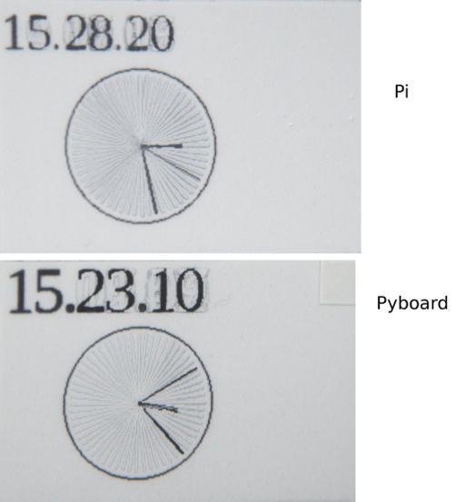

# Ghosting

This only appears in FAST mode, after calling ``refresh()``. The following is an example of a
display from the Pyboard driver in normal mode: no ghosting visible.

This shows the outcome of clock.py on the Pyboard, and raspberry_pi_clock.py on the Pi. In both
cases partial updates are used and ghosting is apparent. It demonstrates that the Pyboard driver
is no worse in this repect than the RePaper reference driver. The two images are from a single
photographic exposure of two displays mounted side by side, so the improved contrast of the Pyboard
image was genuine. However it may simply be a consequence of manufacturing tolerances.

Ghosting can be always be cleared by issuing show() or exchange().

To some degree ghosting can be reduced by design: unlike the official Pi demos, my clock demos aim
to show it at its worst. A prettier clock would result if the second hand and digits were
eliminated and exchange() issued every few minutes.
